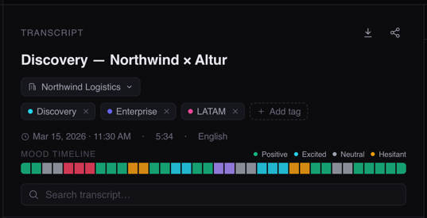
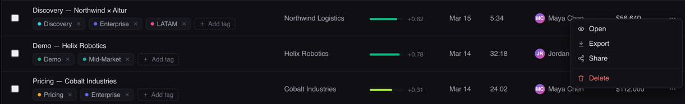
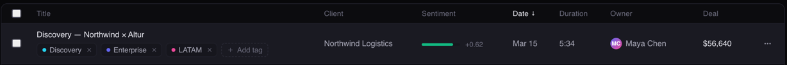
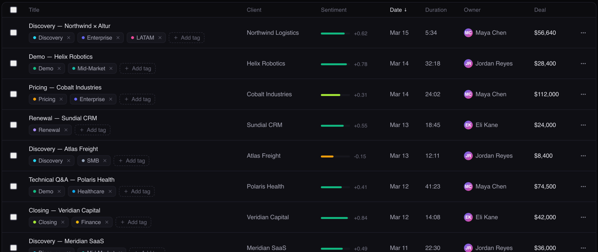

Que se pueda compartir una summary de la conversacion y se pueda descargar
Sistema de notificaciones y busqueda

Sistema de busqueda semantica a traves de todo el sistema tipo busqueda de cliente "x" y se busque el cliente o las menciones de dicha palanbra dentro de las llamadas o transcripts.

Dinero potencial por llamada o metricas de costos por llamadas

El owner es el usuario que realiza el analisis con su cuenta loggeada, se puede implementar un sistema de admin y users y que el admin pueda ver en su panel todos los owners y sus respectivas llamadas

Sistema de deteccion de cliente por voz

Que se importe el audio desde sherapoint o google drive para audios mayores de 5 mb (se va a implementar)

